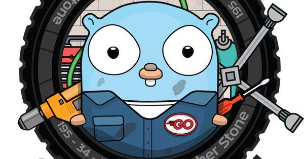

# `Gopher`
>整理收集 Galang 面试、提升的相关内容，希望 gopher 共同进步，欢迎大家提PR。

**此 Repo 目前处于大型施工 🚧现场 ⚠️。**

👉👉👉👉👉👉👉👉👉👉👉👉👉👉👉👉👉👉👉👉👉
> **对于急于了解 golang 面试实际情形的朋友，可先 *👉[戳这里](https://github.com/Uncho/gopher/src/interview)* ！**

  
 
 

 

 

| 📊 |⚔️ | 🖥 | 🚏 | 🏖  | 🌁| 📮 | 🔍 | 🚀 | 🌈 |💡
| :--------: | :---------: | :---------: | :---------: | :---------: | :---------:| :---------: | :-------: | :-------:| :------:|:------:|
| [面试](#经典面试题选集) | [并发](#Go-高并发)|[运行时](#Runtime剖析) | [内存](#内存分配与GC) |[Web](#Web开发相关)|[微服务](#微服务)| [分布式](#分布式系统) |[算法](#数据结构与算法)|[源码学习](#源码学习分享)| [云计算](#云计算)|[联系作者](#联系作者) |

----
现阶段很多内容为个人学习、工作的整理与总结，能力有限，欢迎朋友们指出不足与错误。

还有很多 Golang 生态相关的技术可能没有加进来，本人会一直跟进与维护。热爱开源的小伙伴们尽情加加进来把！

### [经典面试题选集](https://github.com/Uncho/gopher/src/interview)
- [夯实基础](https://github.com/Uncho/gopher/src/interview/basic.md)
- [语法深入]()
- [有趣的go]()
- [设计模式]()

### [Go-高并发](https://github.com/Uncho/gopher/src/concurrent)
- [并发模型简读]()
- [channel and context]()
- [goroutine]()
- [go调度]()

### [Runtime剖析](https://github.com/Uncho/gopher/src/runtime)
- [go编译器]()
- [编译命令执行过程]()
- [go汇编]()
- [go程序启动过程]()
- [技术交流实录]()

### [内存分配与GC](https://github.com/Uncho/gopher/src/memory)
- [示例问题]()
- [内存分配]()
- [垃圾回收(一)]()
- [垃圾回收(二)]()
- [逃逸分析]()
- [内存泄露]()

### [Web开发相关](https://github.com/Uncho/gopher/src/web)
- [web相关知识]()
- [web框架]()
- [Echo使用]()
- [中间件]()
- [与数据库交互]()
- [在线文档]()
- [杂记与小结]()

### [微服务](https://github.com/Uncho/gopher/src/microservice)
- [RPC]()
- [Protobuf]()
- [rpc框架]()
- [服务发现]()
- [负载均衡]()
- [gateway]()
- [消息队列]()

### [分布式系统](https://github.com/Uncho/gopher/src/distributed)
- [数据库水平垂直拆分]()
- [分布式限流]()
- [基于 Redis 的分布式锁]()
- [分布式缓存设计]()
- [分布式 ID 生成器]()
- [搜索引擎]()

### [数据结构与算法](https://github.com/Uncho/gopher/src/algorithm)
- [一致性 Hash 算法]()
- [限流算法]()
- [LRU cache]()
- [待定]()

### [源码学习分享](https://github.com/Uncho/gopher/src/source_code)
- [net/http]()
- [bufio]()
- [micro]()
- [TiDB]()
- [待续]()

### [云计算](https://github.com/Uncho/gopher/src/cloud)
- [容器]()
- [容器编排]()
- [服务发现]()
- [DevOps]()
- [待续]()
 

### 联系作者

  
<a herf="mailto:sergeychang@gmail.com">📮发送邮件到邮箱：sergeychang@gmail.com</a>

个人微信：

 

